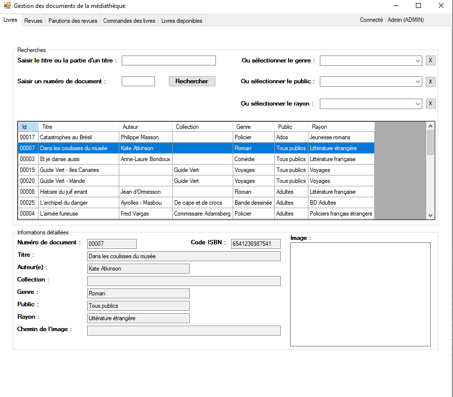

# 📚 **Mediatek86 — Guide Utilisateur**  
*Application de gestion d’une médiathèque*

---

## 📖 **Présentation**  
**Mediatek86** est une application de bureau en C# conçue pour aider le personnel d’une médiathèque à gérer :

- **Les livres**   
- **Les revues**  
- **Les commandes de documents**  

L’application propose une interface **simple** et **efficace** pour centraliser toutes ces opérations.

---

## 🖥️ **Fonctionnalités principales**

### 📌 **Gestion des documents**  
- Consulter la liste des **livres** et **revues** disponibles  
- Afficher les **caractéristiques** de chaque document  
- Consulter les **exemplaires disponibles** pour chaque livre 

### 📌 **Commandes de documents**  
- Ajouter une **commande** pour un livre
- Spécifier le **montant**, le **nombre d'exemplaires** et l’**identifiant** du document  
- Visualiser les commandes existantes et leur **statut**  
- Modifier le statut d'une commande selon son **avancement**  

### 📌 **Authentification**  
- Connexion **sécurisée** via un identifiant et un mot de passe pour un usage local (Déconseiller en ligne !)
- Gestion des **droits** en fonction du rôle de l’utilisateur  

---

## 📸 **Aperçu de l’application**

  

  

  

  

  

  

---

## 🚀 **Démarrage de l’application**

### 📦 **Installation**  
1. Télécharger et extraire le projet ou l’installeur.  
2. Lancer **Mediatek86.exe** ou ouvrir la solution avec **Visual Studio**.  
3. S’assurer que la connexion à la **base de données** est bien configurée.  

### 🔑 **Connexion**  
- Au lancement, une fenêtre de connexion s’affiche.  
- Saisir vos **identifiants personnels** pour accéder à l’application.  
- En cas d’échec, un **message d’erreur** s’affichera et l’application se fermera.  

---

## 📝 **Gestion des commandes**

Depuis le menu **Commandes** :  
1. Cliquez sur **Ajouter une commande**  
2. Remplissez les champs :  
   - **Montant** : prix total de la commande  
   - **Nombre d’exemplaires**  
   - **Identifiant du document**  
3. Validez la commande  

L’application crée automatiquement :  
- Une **commande** associée à votre médiathèque  
- Un **suivi de commande**  
- La **liaison entre commande et document**  

Vous pourrez ensuite **modifier l’état** d’une commande au fur et à mesure de son avancement.

---

## 📊 **Visualisation et suivi**

- Consulter l’état des **commandes en cours** et leur suivi  
- Afficher les documents disponibles et leur **classification** (genre, public, rayon)  
- Consulter la liste des **abonnés** et leur **historique d’emprunts**  

---

## 📌 **Informations supplémentaires**

- Application fonctionnelle en environnement **Windows**  
- Nécessite une connexion réseau si authentification via **API**  
- Gestion des **erreurs** et messages d’**alerte** intégrés  

---

## 📞 **Support**

Pour toute question ou problème, contactez l’**administrateur** de la médiathèque ou consultez la **documentation technique** fournie.

---

## ✅ **Résumé des commandes**

| Fonction                      | Comment faire                      |  
|------------------------------|----------------------------------   |  
| **Se connecter**              | Saisir identifiant et mot de passe|  
| **Ajouter une commande**      | Aller dans **Commandes → Ajouter commande** |  
| **Modifier le statut d’une commande** | Menu **Commandes → Modifier statut** |  
| **Consulter les documents**   | Onglet **Livres / Revues**  |  
